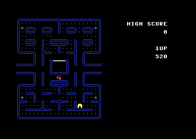

Micro-Pac 64
============

About
-----

This is my attempt to create (yet another) Pac-Man game for the
Commodore 64. My aim is to re-create the experience of the Famicom/NES
port of Pac-Man, and enhance it somewhat. The design goals are:

- Single screen gameplay; no scrolling mazes!
- Arcade accurate ghost AI.
- All intermissions.
- Enhanced sound FX and music.
- High score saving to disk.

Status
------

Right now, the game is still very much a work in progress. In July
2024 I implemented a basic prototype which featured an animated,
joystick-controlled Pac-Man sprite moving through the maze. Since then
I haven't had much time to continue working on the code. The initial
prototype was created on a Commodore 64 using Profi-Ass 64, which was
an excellent assembler for its time. Unfortunately, with our hectic
lifestyles today, most of us simply don't have the kind of time
available anymore that we had back in the '80s and '90s. Waiting 10
minutes for your code to assemble before you can test a routine is
just no longer feasible. So I recently (December 2024) made the
decision to begin converting the code to vasm. This process is now
complete and I can hopefully finish the game in 2025.

Prerequisites
---

- vasm v2.0, available from http://sun.hasenbraten.de/vasm/
- exomizer v3.10, available from https://csdb.dk/release/?id=198340
- VICE or another Commodore 64 emulator

Building
---

    ./build.sh
    

Running
---

    x64sc ./build/micropac64.prg
